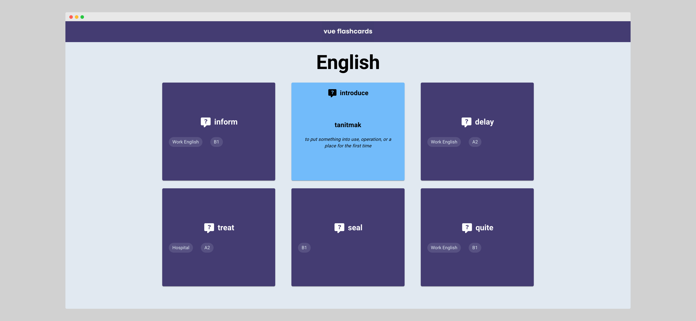

# Vue Flashcards for English Learning

Vue Flashcards is a web application designed to help you improve your English skills by using flashcards. This app makes learning new vocabulary & phrases more fun and easy.

## Project Overview

The project aims to provide a user-friendly interface for people learning English to practice and improve their vocabulary. Vue 3 & Vuetify are used to make it interactive and visually attractive.

## Features

- Interactive Flashcards: Learn in an engaging way with flashcards that can be flipped to show translations or explanations.
- English Data: Curated dataset of English vocabulary and phrases to provide meaningful content for learning.
- Stylish UI: The app has a simple and user-friendly interface created using Vuetify.

## Demo & Screenshots

### [**Demo**](http://yeliz.sevinc.cloud/#/)




## Technologies Used

- Vue 3: Progressive JS framework
- Vuetify: Material Design component framework
- Vite: Fast build tool and development server
- WebFontLoader: Easy integration of web fonts

## Getting Started

1. **Installation**: Clone the repository and install dependencies.

   ```bash
   yarn install
   ```

2. **Development**: Start the development server and open the app in your browser.

   ```bash
   yarn dev
   ```

3. **Build**: Compile and minify the app for production.

   ```bash
   yarn build
   ```

4. **Linting**: Run code linting to ensure code quality.

   ```bash
   yarn lint
   ```
